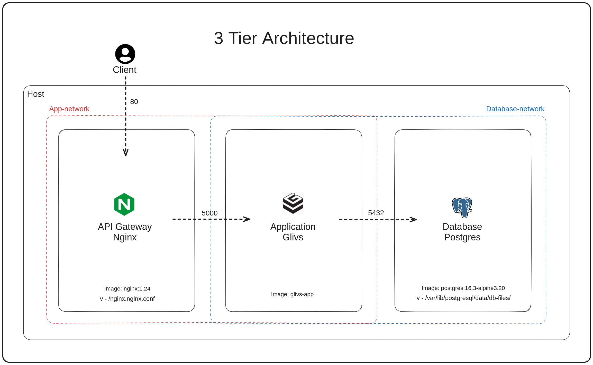
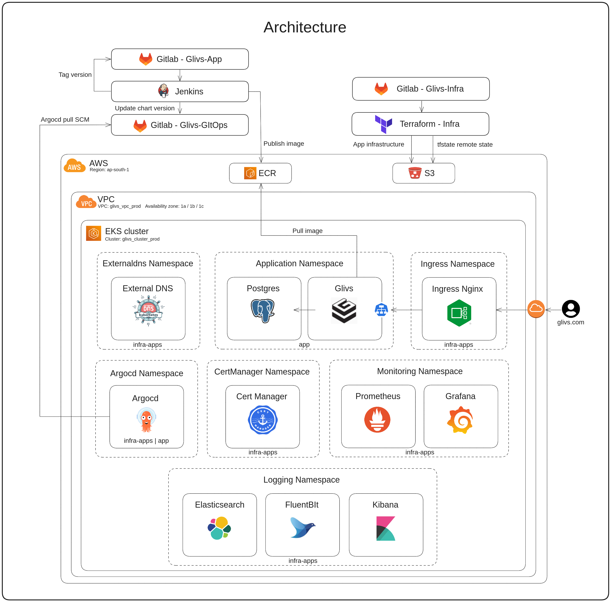

# Exptracker (Glivs) App - Financial Management Application

This application is a full-stack application designed to help users manage their finances. Users can sign up, log in, view their financial data, add expenses, and delete expenses. The application is built with a Docker Compose configuration for easy deployment and uses PostgreSQL as the database.

## Getting Started

### Prerequisites

- Docker: [Download Docker Desktop](https://www.docker.com/products/docker-desktop/)
- Docker Compose: [Documentation](https://docs.docker.com/compose/)
- A code editor or IDE of your choice

### Steps

1. **Clone this repository:**

    ```bash
    git clone https://github.com/DanArbib/exptracker-application.git
    ```

2. **Navigate to the project directory:**

    ```bash
    cd exptracker-application
    ```

3. **Create a `.env` file in the root directory of the project and add the following environment variables:**

    ```plaintext
        # Flask
        FLASK_SECRET_KEY=
        JWT_SECRET_KEY=
        PG_HOST=pg
        PG_PORT=5432

        # Postgres
        POSTGRES_PASSWORD=
        POSTGRES_USER=
        POSTGRES_DB=
        PGDATA=/var/lib/postgresql/data/db-files/
    ```

4. **Start the application using Docker Compose:**

    ```bash
    docker-compose up -d
    ```

    This will start all the required services, including the PostgreSQL database, Flask application, and Nginx reverse proxy.

5. **Access the application in your web browser at** [http://localhost:80](http://localhost:80)

## Architecture Overview





## Endpoints

The application provides a variety of endpoints for user management, expense management, and health checks.

### User Management

- **POST /api/v1/sign**: Creates a new user account.
- **POST /api/v1/login**: Logs in a user with email and password.
- **GET /api/v1/user**: Retrieves user data (email and credits).

### Expense Management

- **POST /api/v1/expenses**: Adds a new expense for the authorized user.
- **GET /api/v1/expenses**: Retrieves all expenses for the authorized user.
- **DELETE /api/v1/expenses/:expense_id**: Deletes an expense for the authorized user.

### Health Check

- **GET /health**: Returns a 200 status code if the application is healthy.

## Additional Notes

- The application uses JWT (JSON Web Token) for authentication.
- The application uses Prometheus for metrics collection.

## Contributing

We welcome contributions to this project. Please see the `CONTRIBUTING.md` file for guidelines on how to contribute.

## License

This project is licensed under the MIT License. See the `LICENSE` file for details.